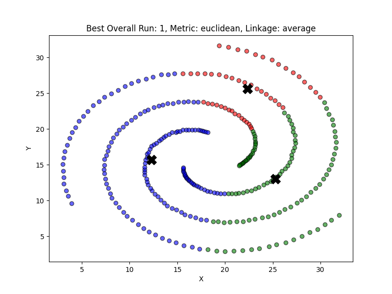
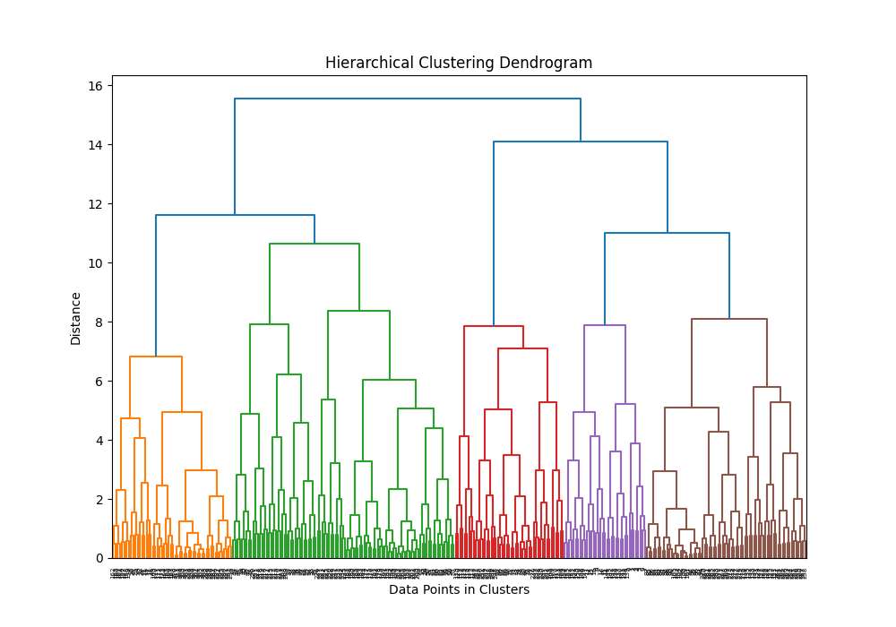

# Spiral-Clustering 

## part 2: Hierarchical Clustering
Using the spiral-dataset.csv to generate a spiral figure.  
Challenging to cluster due to the nature of the data.

Completed all required tasks as detailed in `HW4-UL-handout-sp25.pdf`:
- Implemented hierarchical clustering (with Euclidean, cosine, and L3 distances).  
- Evaluated clusters using Sum of Squared Errors (SSE), Rand Index (RI), Cophenetic Correlation Coefficient (CCC), and Silhouette Score.  
- Ran 3 iterations (this is an adjustable parameter in main.py) for all metrics and linkage methods:
    - `metrics = ["euclidean", "cosine", "l3"]`
    - `linkage_methods = ["single", "complete", "average", "centroid"]`
- All plots can be found at plots/part2 a total of 73 plots can be found.
- Terminal_output_part2.txt shows my outputs during testing, inlcluding all metics and other information like to diffireinete between run and plot.
- The best hierarchical run is selected based on a priority system that emphasizes **cophenetic correlation coefficient (CCC)** as the strongest indicator of hierarchical structure, followed by silhouette score, then random index, and finally SSE.

Here are the results from my best run:
```bash
Best Hierarchical Run Details:

Run: 1 | Metric: euclidean | Linkage: average
Best SSE: 14132.1538 | Best Rand Index: 0.5366
Best Cophenetic Corr Coef: 0.6109 | Best Silhouette Score: 0.4027
PS C:\Users\ramos\Desktop\GitHub\Spiral-Clustering> 
```
And the respective plot and dendogram




## Set-up

Follow these steps in your terminal to get started:

1. **Clone the repository**
```bash
git clone git@github.com:ramosv/Spiral-Clustering.git
```

2. **Navigate into the project directory**
```bash
cd Spiral-Clustering
```

3. **Create a virtual environment**
```bash
python -m venv .venv
```

4. **Activate the virtual environment**
```bash
source .venv/Scripts/activate  # On Windows
# Or use: source .venv/bin/activate  # On macOS/Linux
```

5. **Install dependencies**
```bash
pip install -r requirements.txt
```

6. **Test the pipeline**
```bash
python main.py
```


## Spiral-Clustering part 1
Using the spiral-dataset.csv to generate a spiral figure.  
Challenging to cluster due to the nature of the data.

Completed all required tasks(as detailed in `HW2-UL-handout-sp25.pdf`) plus some extra
- Implemented k-means clustering (with Euclidean, cosine, and L3 distances).  
- Evaluated clusters using Sum of Squared Errors and random index.  
- Ran 10 random initializations per metric and selected the best run.  
- plots dir has all the plots
- terminal output as the correspoing output for these plots

Note: For my k-means implementation, and anything inside the cluster_it component I avoided using numpy operations in key parts to dig dipper into how is it that its working behind the scenes.

Just to see if if I could get better values, I wanted to to test some other algortihms to see if they would perform better when clustering. This code can be found in the extra.py and I added the output to the terminal_output.txt

ramos@Lenovo ~/Desktop/GitHub/Spiral-Clustering (main)
$ python -m venv .venv

activate the virtual environment  
ramos@Lenovo ~/Desktop/GitHub/Spiral-Clustering (main)
$ source .venv/Scripts/activate
(.venv)
ramos@Lenovo ~/Desktop/GitHub/Spiral-Clustering (main)
$
